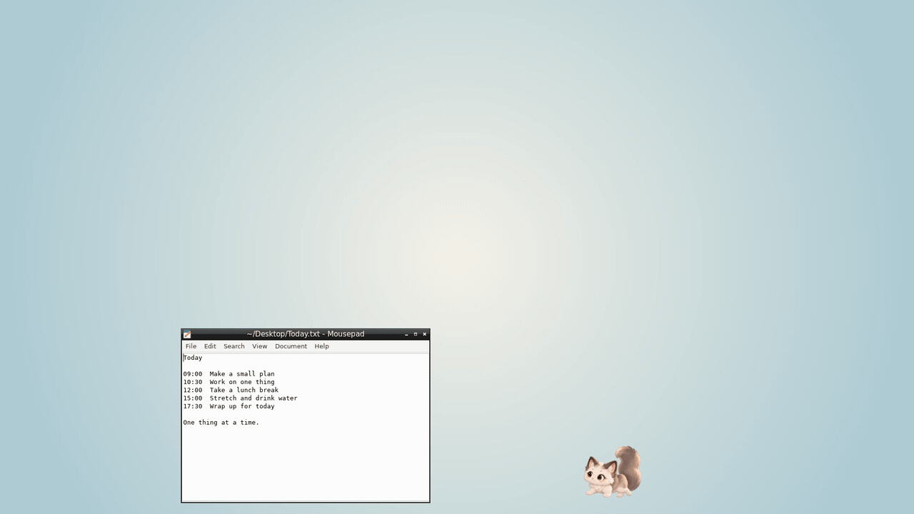

# Mischief Pet

A little companion for your desktop — a desktop cat for **Windows, macOS and Linux (beta)** by **Neo Genesis** that roams, peeks and naps beside your work. Feed, pet and name your friend. No app account; pet saves stay on your device.

**Free:** core care, movement, settings, instant hide (**Ctrl+Shift+H on Windows/Linux / ⌘+Shift+H on Mac**), reduced motion, and 3 Focus Buddy + 3 Window Perch trial uses. No forced startup. On Linux, Window Perch requires X11 (EWMH window manager with restacking, libX11, 100% display scaling / scale 1); not available on Wayland.

**Plus:** Focus Buddy, optional water/stretch reminders and Window Perch. US$4.99 launch price, one-time purchase, no subscription; check taxes and the final total at checkout. Activate your Gumroad license key in the app's Plus settings; initial verification needs internet and your operating system's secure storage. Let the first activation finish before quitting the app; if it was interrupted, reopen the app and enter the key again. The same download includes Free and optional Plus. On Linux, Window Perch requires X11 (EWMH window manager with restacking, libX11, 100% display scaling / scale 1); not available on Wayland.

- [Official website](https://mischiefpet.neogenesis.app)
- [Get Plus on Gumroad](https://neogenesis4.gumroad.com/l/mischief-pet?variant=Plus)
- [Free download on itch.io](https://neogenesis-studio.itch.io/mischief-pet)
- [Privacy policy](https://mischiefpet.neogenesis.app/en/privacy/) · [Terms](https://mischiefpet.neogenesis.app/en/terms/) · [Refunds](https://mischiefpet.neogenesis.app/en/refund/)
- Support: [help@neogenesis.app](mailto:help@neogenesis.app)

## Downloads · 다운로드 / SHA-256

Get one file for your OS/chip from [v0.5.1 Releases](https://github.com/Yesol-Pilot/mischief-pet/releases/tag/v0.5.1). 내 OS/칩에 맞는 파일 하나를 받으세요.

| OS / architecture · OS / 아키텍처 | File / 파일 | SHA-256 |
| --- | --- | --- |
| Windows x64 · installer / 설치형 | [`Mischief-Pet-Setup-0.5.1.exe`](https://github.com/Yesol-Pilot/mischief-pet/releases/download/v0.5.1/Mischief-Pet-Setup-0.5.1.exe) | `7a1a602dc692b606bcbae9545c25efdf03208dec2be0d7166a90d000315acd3a` |
| Windows x64 · portable ZIP | [`Mischief-Pet-0.5.1-Windows-x64.zip`](https://github.com/Yesol-Pilot/mischief-pet/releases/download/v0.5.1/Mischief-Pet-0.5.1-Windows-x64.zip) | `2eb551eb256cf16aed5dfaf67d43777cbf27a7f863b0e24d09481d53b1e7f46c` |
| macOS Apple silicon (arm64) · DMG | [`Mischief-Pet-0.5.1-macOS-arm64.dmg`](https://github.com/Yesol-Pilot/mischief-pet/releases/download/v0.5.1/Mischief-Pet-0.5.1-macOS-arm64.dmg) | `011f97ce10ddb5d10f0697ea9898e18945e706c1a148a757e17eb4cc5b616f27` |
| macOS Apple silicon (arm64) · ZIP | [`Mischief-Pet-0.5.1-macOS-arm64.zip`](https://github.com/Yesol-Pilot/mischief-pet/releases/download/v0.5.1/Mischief-Pet-0.5.1-macOS-arm64.zip) | `16f6dd611bacf6cbedbd56e63da2a5dbab3998e81d963026607055dc0207b8ce` |
| macOS Intel (x64) · DMG | [`Mischief-Pet-0.5.1-macOS-x64.dmg`](https://github.com/Yesol-Pilot/mischief-pet/releases/download/v0.5.1/Mischief-Pet-0.5.1-macOS-x64.dmg) | `e3d6aefd91a74f4a556a9656840e39fcd123ec4c43dd8947c7799a6fc511e15a` |
| macOS Intel (x64) · ZIP | [`Mischief-Pet-0.5.1-macOS-x64.zip`](https://github.com/Yesol-Pilot/mischief-pet/releases/download/v0.5.1/Mischief-Pet-0.5.1-macOS-x64.zip) | `8669391f9cac767d0801b7f5aec4cee035797a94357d9a9b39199859899e292d` |
| Linux beta · x64 (amd64) · Debian package | [`mischief-pet_0.5.1_amd64.deb`](https://github.com/Yesol-Pilot/mischief-pet/releases/download/v0.5.1/mischief-pet_0.5.1_amd64.deb) | `1876552b9bd588e32b41a6e0fc1e952d242bbcc8f81161ad51698094c25907cd` |
| Linux beta · arm64 · Debian package | [`mischief-pet_0.5.1_arm64.deb`](https://github.com/Yesol-Pilot/mischief-pet/releases/download/v0.5.1/mischief-pet_0.5.1_arm64.deb) | `cf95a4221e3a094d06178f049f2e59ebfc61366e4e6ea81dd722880d03044238` |

The two **Windows** binaries are byte-identical to the files distributed on the official Gumroad listing. This statement is Windows-specific.

## Requirements and installation

**Platforms:** Windows 10/11 x64; macOS 12 or later, Apple silicon (arm64) or Intel (x64). Tested on macOS 26. **Linux beta is available for x64/arm64 (.deb only).**

Quit fully before updating or removing Mischief Pet, and allow a few seconds for the app to finish closing.

### Windows

Run `Mischief-Pet-Setup-0.5.1.exe`. It installs for the current user without administrator rights and creates a Start-menu shortcut. Alternatively, fully extract `Mischief-Pet-0.5.1-Windows-x64.zip`, keep all files together and run `MischiefPet.exe` outside the ZIP. Quit from the tray menu before uninstalling in Windows Settings → Apps, or deleting the extracted ZIP folder. Local saves are kept; export anything important from Settings first.

**Windows-only unsigned / SmartScreen note:** the Windows release is not code-signed. Windows may show “Windows protected your PC.” Verify the official download URL and SHA-256 above. Only if you trust the download, select **More info → Run anyway**. Do not disable Windows security or bypass work/school device policies.

### Mac

Choose **arm64 for Apple silicon** or **x64 for Intel** (Apple menu → About This Mac). Open the matching DMG, drag Mischief Pet to Applications and launch. For the matching ZIP alternative, fully extract it, move Mischief Pet to Applications and launch.

The Mac app is **Developer ID-signed and notarized by Apple**. The first time you open it, macOS may ask you to confirm — that is normal for apps downloaded outside the App Store. It runs from the **menu bar with no Dock icon**. Hide instantly with **⌘+Shift+H**. Before removal, **quit from the menu-bar menu**, then delete Mischief Pet from Applications. Local saves remain in `~/Library/Application Support`. Export anything important from Settings first.

### Linux beta (.deb only)

Linux beta (.deb only): choose `mischief-pet_0.5.1_amd64.deb` for x64 or `mischief-pet_0.5.1_arm64.deb` for arm64. Install with `sudo apt install ./mischief-pet_0.5.1_amd64.deb` (or `sudo apt install ./mischief-pet_0.5.1_arm64.deb`). Launch “Mischief Pet” from the app menu (Utility/Amusement). Quit before uninstalling with `sudo apt remove mischief-pet`; local saves remain in `~/.config`. Hide with `Ctrl+Shift+H`. Plus uses the same Gumroad license key in the app’s Plus settings; initial verification needs internet. Linux beta packages are not code-signed. The floating desktop pet needs an X11 session with a compositor (standard Ubuntu desktops have one); on Wayland there is no desktop overlay or Window Perch; the app runs in an ordinary window. Tested on Ubuntu 24.04 (x64 and arm64) with the Chromium sandbox enabled; other Debian-based distributions are untested. On Linux, Window Perch requires X11 (EWMH window manager with restacking, libX11, 100% display scaling / scale 1); not available on Wayland. Installing the .deb adds a root-owned setuid Chromium sandbox helper and an AppArmor profile that allows user namespaces for the Mischief Pet executable only, so the app can run with its sandbox enabled on Ubuntu 24.04. Run Mischief Pet as your normal desktop user — never with sudo. `sudo apt remove mischief-pet` removes both.

This repository hosts official release downloads and information only. It does **not** publish the application's source code or grant an open-source license. Use is governed by the [product terms](https://mischiefpet.neogenesis.app/en/terms/).

## 한국어

**Mischief Pet — 작은 동거인, 나의 바탕화면.** Neo Genesis의 Windows·macOS·Linux(베타) 데스크톱 고양이입니다. 바탕화면을 산책하고 창 뒤에서 빼꼼하며 곁에서 쉽니다. 밥을 주고 쓰다듬고 이름을 지어 주세요. 앱 계정 없이 내 기기에 저장합니다.

**Free:** 기본 돌봄·움직임·설정·즉시 숨기기(**Windows/Linux Ctrl+Shift+H / Mac ⌘+Shift+H**)·움직임 줄이기, 집중 친구 3회와 창 위에 앉기 3회 체험. 강제 자동 시작은 없습니다. Linux의 창 위에 앉기는 X11 세션(EWMH 창 관리자와 재적층, libX11, 화면 배율 100% / scale 1)에서만 작동하며 Wayland에서는 사용할 수 없습니다.

**Plus:** 집중 친구, 물·스트레칭 휴식 알림, 창 위에 앉기. 출시가 US$4.99 일회 구매이며 정기 구독이 아닙니다. 결제 화면의 세금·최종 금액을 확인하세요. Gumroad Plus 영수증의 라이선스 키를 앱 Plus 설정에 입력하면 활성화됩니다. 최초 확인에는 인터넷과 운영체제의 보안 저장소가 필요합니다. 처음 활성화가 끝난 뒤 앱을 종료하세요. 중간에 끊겼다면 앱을 다시 열고 키를 다시 입력하세요. Free와 Plus는 같은 다운로드 파일을 사용합니다. Linux의 창 위에 앉기는 X11 세션(EWMH 창 관리자와 재적층, libX11, 화면 배율 100% / scale 1)에서만 작동하며 Wayland에서는 사용할 수 없습니다.

**지원 OS:** Windows 10/11 x64, macOS 12 이상(Apple silicon/arm64 또는 Intel/x64). macOS 26에서 테스트했습니다. **Linux 베타(x64/arm64, .deb)를 제공합니다.**

Mischief Pet을 업데이트하거나 제거하기 전에 완전히 종료하고, 앱이 닫히는 것을 마칠 수 있도록 몇 초 기다리세요.

**Windows 설치·제거:** 위 EXE 설치형은 관리자 권한 없이 현재 사용자에게 설치하고 시작 메뉴에 등록합니다. Windows ZIP은 전체 압축을 풀고 모든 파일을 같은 폴더에 유지한 채 `MischiefPet.exe`를 실행하세요. ZIP 안에서 직접 실행하지 마세요. 트레이 메뉴에서 종료한 뒤 Windows 설정 → 앱에서 제거하세요. ZIP은 종료 후 풀었던 폴더를 삭제합니다. 로컬 펫 저장은 유지됩니다.

**Windows 전용 코드 서명·SmartScreen 안내:** Windows 배포본은 서명하지 않아 “Windows의 PC 보호” 경고가 나올 수 있습니다. 공식 URL과 위 SHA-256을 확인한 뒤 신뢰한다면 **추가 정보 → 실행**을 선택할 수 있습니다. Windows 보안을 끄거나 조직의 차단 정책을 우회하지 마세요. 위 **Windows 두 파일만** 공식 Gumroad 배포본과 바이트 단위로 같다는 설명을 적용합니다.

**Mac 설치·제거:** Apple 메뉴 → 이 Mac에 관하여에서 칩을 확인하고 Apple silicon은 arm64, Intel은 x64 파일을 받으세요. DMG를 열고 Mischief Pet을 응용 프로그램(Applications)으로 드래그한 뒤 실행하세요. ZIP 대안은 전체 압축을 풀고 앱을 Applications로 옮겨 실행하세요. Mac 앱은 **Developer ID로 서명되고 Apple 공증을 받았습니다**. 처음 열 때 macOS가 열기 확인을 물을 수 있으며, App Store 밖에서 받은 앱의 일반적인 절차입니다. **Dock 아이콘 없이 메뉴 막대**에서 작동합니다. **⌘+Shift+H**로 즉시 숨길 수 있습니다. 제거 전 **메뉴 막대 메뉴에서 종료한 뒤** Applications의 앱을 삭제하세요. 로컬 저장은 `~/Library/Application Support`에 남습니다. 중요한 데이터는 설정에서 먼저 내보내세요.

**Linux 베타 설치·제거 (.deb 전용):** Linux 베타(.deb 전용): x64는 `mischief-pet_0.5.1_amd64.deb`, arm64는 `mischief-pet_0.5.1_arm64.deb`를 받으세요. `sudo apt install ./mischief-pet_0.5.1_amd64.deb` 또는 `sudo apt install ./mischief-pet_0.5.1_arm64.deb`로 설치하고 앱 메뉴(Utility/Amusement)에서 “Mischief Pet”을 실행하세요. 앱을 종료한 뒤 `sudo apt remove mischief-pet`으로 제거하세요. 로컬 저장은 `~/.config`에 남습니다. `Ctrl+Shift+H`로 숨길 수 있습니다. Plus는 앱 Plus 설정에 같은 Gumroad 라이선스 키를 입력해 활성화하며 최초 확인에는 인터넷이 필요합니다. Linux 베타 패키지는 코드 서명이 없습니다. 떠다니는 바탕화면 펫에는 컴포지터가 있는 X11 세션이 필요합니다(표준 Ubuntu 데스크톱에는 컴포지터가 있습니다). Wayland에서는 바탕화면 오버레이와 창 위에 앉기를 사용할 수 없으며 앱은 일반 창으로 실행됩니다. Chromium 샌드박스를 켠 Ubuntu 24.04(x64·arm64)에서 테스트했으며 다른 Debian 계열 배포판은 테스트하지 않았습니다. Linux의 창 위에 앉기는 X11 세션(EWMH 창 관리자와 재적층, libX11, 화면 배율 100% / scale 1)에서만 작동하며 Wayland에서는 사용할 수 없습니다. .deb 설치 시 root 소유 setuid Chromium 샌드박스 도우미와 Mischief Pet 실행 파일에만 사용자 네임스페이스를 허용하는 AppArmor 프로필이 추가되어 Ubuntu 24.04에서 샌드박스를 켠 채 실행할 수 있습니다. Mischief Pet은 일반 데스크톱 사용자로 실행하고 절대 sudo로 실행하지 마세요. `sudo apt remove mischief-pet`으로 둘 다 제거됩니다.

[공식 웹사이트](https://mischiefpet.neogenesis.app/) · [Gumroad Plus 구매](https://neogenesis4.gumroad.com/l/mischief-pet?variant=Plus) · [itch.io 무료 다운로드](https://neogenesis-studio.itch.io/mischief-pet) · [개인정보](https://mischiefpet.neogenesis.app/privacy/) · [이용약관](https://mischiefpet.neogenesis.app/terms/) · [환불](https://mischiefpet.neogenesis.app/refund/)

제품 지원: [help@neogenesis.app](mailto:help@neogenesis.app). 이 저장소는 공식 배포 파일과 안내만 제공합니다. 소스 코드는 공개하지 않으며 오픈소스 라이선스를 부여하지 않습니다. 이용에는 제품 약관이 적용됩니다.
